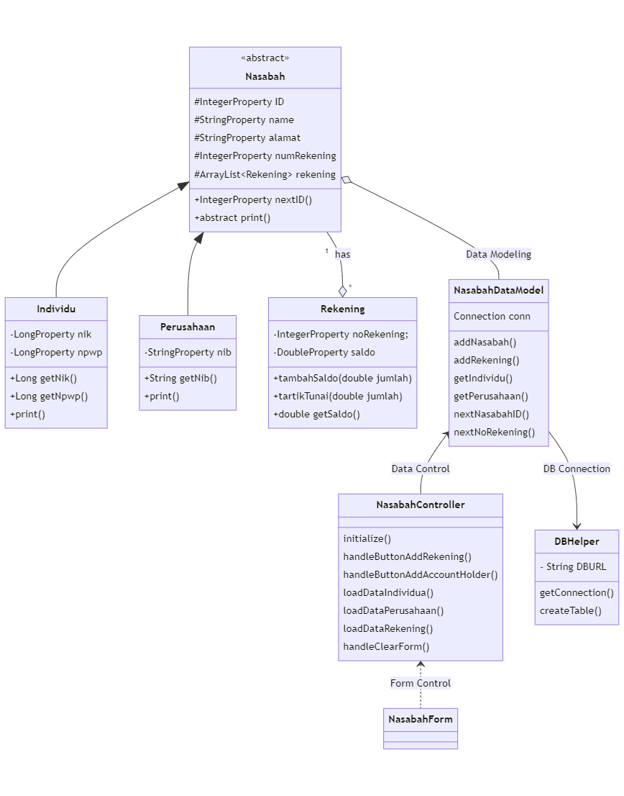
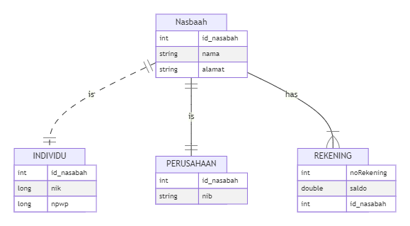

# Final_Project_Kelompok_PBO

Anggota :

Aullya Hanan Wulandari 2017051079
Muhammad Sultan Raisyah 2057051019
Taufik Jaka Lesmana 1717051068

# Pembagian Tugas :

Taufik Jaka Lesmana : Menginisialisasi dan mengembangkan class yang digunakan dalam project

Aullya Hanan Wulandari : Membuat dan menghubungkan program dengan database SQLite

Muhammad Sultan Raisyah : Mendesain dan membuat GUI menggunakan JavaFX dan Scene Builder

```Language
classDiagram

Nasabah <|-- Individu
Nasabah <|-- Perusahaan
Nasabah "1"--o"*" Rekening : has
Nasabah o-- NasabahDataModel : Data Modeling
NasabahDataModel <-- NasabahController : Data Control
NasabahDataModel --> DBHelper : DB Connection
NasabahController <.. NasabahForm : Form Control
class Nasabah{
  <<abstract>>
  #IntegerProperty ID
  #StringProperty name
  #StringProperty alamat
  #IntegerProperty numRekening
  #ArrayList<Rekening> rekening
  +IntegerProperty nextID()
  + abstract print()
}

class Individu{
  -LongProperty nik
  -LongProperty npwp
  +Long getNik()
  +Long getNpwp()
  +print()
}
class Perusahaan{
  -StringProperty nib
  +String getNib()
  +print()
}
class Rekening{
  -IntegerProperty noRekening;
  -DoubleProperty saldo
  +tambahSaldo(double jumlah)
  +tartikTunai(double jumlah)
  +double getSaldo()
}

class NasabahDataModel{
    Connection conn
    addNasabah()
    addRekening()
    getIndividu()
    getPerusahaan()
    nextNasabahID()
    nextNoRekening()
}

class NasabahController{
    initialize()
    handleButtonAddRekening()
    handleButtonAddAccountHolder()
    loadDataIndividua()
    loadDataPerusahaan()
    loadDataRekening()
    handleClearForm()
}
class DBHelper{
    - String DBURL
    getConnection()
    createTable();
}
```



```Language
erDiagram
           Nasbaah ||..|| INDIVIDU : is
           Nasbaah ||--|| PERUSAHAAN : is
           Nasbaah ||--|{ REKENING : "has"
           Nasbaah {
               int id_nasabah
               string nama
               string alamat
           }
           INDIVIDU{
               int id_nasabah
               long nik
               long npwp
           }
           PERUSAHAAN{
               int id_nasabah
               string nib
           }
           REKENING{
               int noRekening
               double saldo
               int id_nasabah
           }
```

